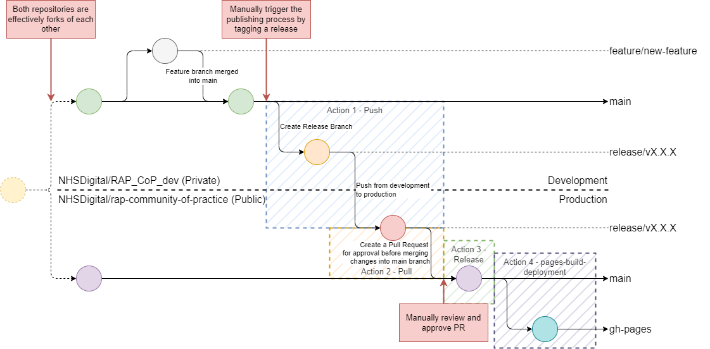
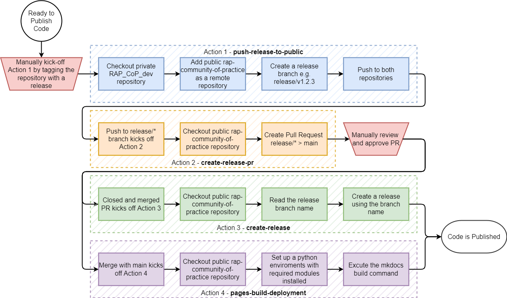
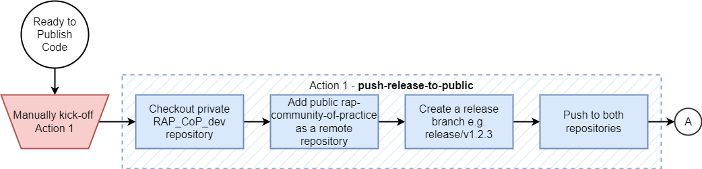
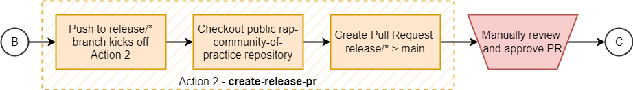
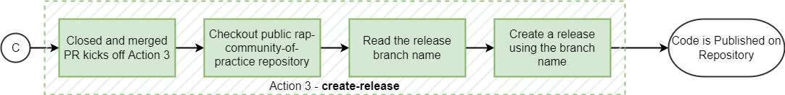
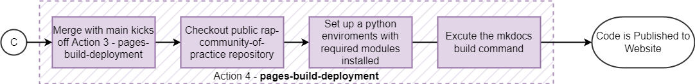

# RAP Release Workflow

The RAP Community of Practice exists on two repositories. The public [rap-community-of-practice], where anyone can view our guidance, and the private [RAP_CoP_dev], which is where guidance is written and reviewed before it is published to the public repository. The public repository is then converted using [MkDocs] to hmtl and hosted by GitHub pages as our [RAP Community of Practice website].

The RAP Release Workflow allows the RAP Team to:

* Automate a repetitive but simple process with manual intervention
* Control when the release process occurs
* Provide a clearer history of releases to the RAP Community of Practice
* Easily maintain and change the process if required

The release process uses GitHub Actions to execute. GitHub Actions is a continuous integration and continuous deliver (CI/CD) platform that allows automation of processes. A highly beneficial feature of GitHub Actions is the ability to automatically run workflows when events happen in your GitHub repository; in our case, when a release is published, a branch is pushed to, a pull request is closed and merged, and when a directory is updated.

The GitHub Actions are written using the YAML markdown language to execute, in this case:

* Pre-defined GitHub Actions, such as `actions/checkout@v3`.
* Shell scripts that run Bash, git, and GitHub CLI commands.

Other functionality also exists, like setting up and using Docker containers, and can be explored in the [GitHub Actions documentation].

The process is made up of 4 distinct steps. One that runs on the private [RAP_CoP_dev] and the other three that run on the public [rap-community-of-practice]. The first figure below shows an Git Flow Overview of deployment process and where the four actions are involved. The second figure below shows a flowchart of the release process, roughly summarising the steps within the actions.



> Note:
>
> For clarity and simplicity the Git Flow diagram shows Action 3 executing before Action 4. In practice, they will execute a roughly the same time, although are triggered by slightly different events.
>
> The Release Process Flowchart (below) more accurately depicts the process flow.



## Action 1 - Push Release to Public RAP CoP Repo



Action 1 is kicked off by creating and publishing a release to the private [RAP_CoP_dev]. The release tags the repository with the semantic version number, e.g. v1.2.3.

Action 1 can also be manually dispatched in GitHub (or via an API call) due to the addition of the `workflow_dispatch` event trigger.

```yml
on:
  release:
    types: [published]
  workflow_dispatch:
```

Action 1 executes one job, called push-release. This job runs on the latest version of Ubuntu available through GitHub Actions.

GitHub Actions provides the condational

```yml
jobs:
  push-release:
    runs-on: 'ubuntu-latest'
    if: github.repository == 'josephwilson8-nhs/test_publish_from'
```

```yml
    steps:
      - name: Checkout code
        uses: actions/checkout@v3
        with:
          token: ${{ secrets.EXTERNAL_REPO_TOKEN }}
          fetch-depth: 0
```

```yml
      - name: Add the public repository as a remote
        run: |
          git remote add public https://github.com/josephwilson8-nhs/test_publish_to.git
          git remote -v
```

```yml
      - name: Read the release name and create a branch. Push branch to private and public.
        run: |
          RELEASE_NAME=$(gh release view --json name | jq -r '.name')
          RELEASE_BRANCH=release/$RELEASE_NAME
          git branch $RELEASE_BRANCH
          git push -u origin $RELEASE_BRANCH
          git push -u public $RELEASE_BRANCH
        env:
          GITHUB_TOKEN: ${{ secrets.EXTERNAL_REPO_TOKEN }}
```

## Action 2 - Create Pull Request for Release Branch



```yml
on:
  push:
    branches:
    - release/*
  workflow_dispatch:
```

```yml    
jobs:
  create_pr:
    runs-on: ubuntu-latest
    if: github.repository == 'josephwilson8-nhs/test_publish_to'
```

```yml
    steps:
      - uses: actions/checkout@v3
        with:
          fetch-depth: 0
```

```yml
      - name: Create Pull Request
        run: |
          gh pr create --fill
        env:
          GITHUB_TOKEN: ${{ secrets.GITHUB_TOKEN }}
```

## Action 3 - Create a Release



```yml
on:
  pull_request:
    types:
      - closed
```

```yml
jobs:
  release_if_merged:
    if: |
      github.event.pull_request.merged == true && 
      startsWith(github.head_ref, 'release/v') &&
      github.repository == 'josephwilson8-nhs/test_publish_to'
    runs-on: ubuntu-latest
```

```yml
    steps:
      - name: Checkout code
        uses: actions/checkout@v3
```

```yml
      - name: Get Release Name from PR Branch Name and create a release
        run: |
          RELEASE_NAME=${HEAD_REF//release\//}
          gh release create $RELEASE_NAME -t $RELEASE_NAME
        env:
          GITHUB_TOKEN: ${{ secrets.GITHUB_TOKEN }}
          HEAD_REF: ${{ github.head_ref }}
```

## Action 4 - Build and Deploy Website Pages



```yml
on:
  push:
    branches:
      - 'main'
    paths:
      - 'docs/**'
  workflow_dispatch:
```

```yml
jobs:
  deploy:
    runs-on: ubuntu-latest
```

```yml
    steps:
      - uses: actions/checkout@v3
```

```yml
      - uses: actions/setup-python@v2
        with:
          python-version: 3.x
      - run: pip install -r requirements.txt
```

```yml
      - run: mkdocs gh-deploy --force --clean --verbose
```

[rap-community-of-practice]: https://github.com/NHSDigital/rap-community-of-practice
[RAP_CoP_dev]: https://github.com/NHSDigital/RAP_CoP_dev
[MkDocs]: https://www.mkdocs.org/
[RAP Community of Practice website]: https://nhsdigital.github.io/rap-community-of-practice/
[GitHub Actions documentation]: https://docs.github.com/en/actions
[GitHub CLI]: https://cli.github.com/manual/
[gh release create]: https://cli.github.com/manual/gh_release_create
[gh release view]: https://cli.github.com/manual/gh_release_view
[Deploying your docs]: https://www.mkdocs.org/user-guide/deploying-your-docs/
